# Hosting a Static Website on Azure Storage with Azure Front Door and Azure DNS Zones
This project demonstrates how to host a static website using an Azure Storage Account (Blob container) integrated with Azure Front Door. It also explains how to configure Azure DNS for custom domain hosting and access the static website through the custom domain.

## Benefits of hosting a static website on Azure ?
- **Simplicity:** All you have to do is upload your web folders and files to a container
- **Saving on hosting cost:** Cheaper compared to buying hosting fee from a web hosting company
- **Better Performance:** Azure Front Door can be configured to get a better performance delivering contents to your end users around the world
Combining Azure Front Door with blob storage provides a low-cost and highly reliable static website hosting solution. These static sites have only CSS, HTML, JS files, fonts, etc

## Prerequisites
- Create Microsoft Azure Account
- Create a Subscription
- Create a Resource Group and Storage Account
- Have a registered domain (Optional)

**Note:** To those that are new to the Azure platform, when you create a free account, you get a $200 free Azure credit to create resources for 30 days and a subscription is automatically created.

## Outline of workflow
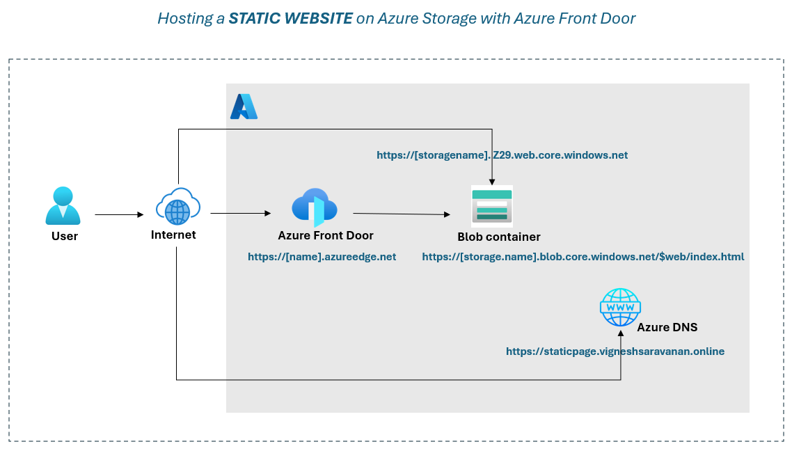

## Step 1: Enabling static website on storage account
Now click on static website and enable the storage account to host static content webpages.
Enter the index.html inside the index document block, you can also specify a root file for 404 error but we are not interested in that for this demo. Save and when it is enabled a primary endpoint https://statichost.z29.web.core.windows.net/ is created automatically this is just a generic URL for your end users to access your website contents.

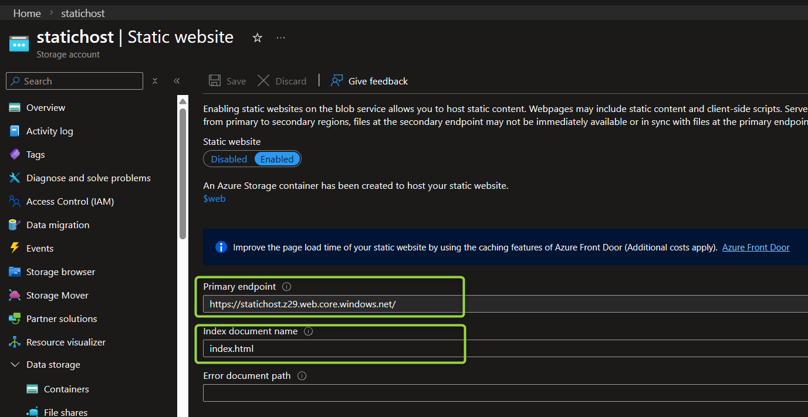

Also, after enabling static website a container `$web` is automatically created, this container would hold your web content files and folders.

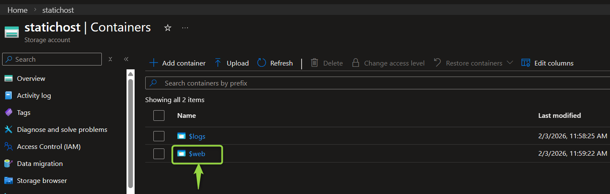

## Step 2: Upload web contents to container
Now it's time to upload our website contents to the container $web. You might be thinking uploading the web content to the container from the portal should be easy by just clicking the upload button and upload the web folders and files to the container. Unfortunately, you cannot upload folders to the container from the portal directly except for files.

To upload our web contents to the container we would make use of a tool called AzCopy. [AzCopy](https://docs.microsoft.com/en-us/azure/storage/common/storage-use-azcopy-v10#download-azcopy) is a CLI (command-line) tool that moves data into and out of an Azure Storage.

Remember the primary endpoint link `https://statichost.z29.web.core.windows.net/` that was generated when you enabled static website on your storage account? now that is the link for your end users to access your content on the public web.

**Watch the below Primary Endpoint from Blob Storage for access the static content** 👇


## Step 3: Configure Azure Front Door or Azure CDN
Azure Front Door and Azure CDN are both Azure services that offer global content delivery with intelligent routing and caching capabilities at the application layer. Both services can be used to optimize and accelerate your applications by providing a globally distributed network of points of presence (POP) close to your users. Both services also offer various features to help you secure your applications from malicious attacks and to help you monitor your application's health and performance.

In our usecase, We use `Azure Front Door`. Azure Front Door is Microsoft's advanced cloud Content Delivery Network (CDN) designed to provide fast, reliable, and secure access to your applications' static and dynamic web content globally. Please read the [official documentation](https://learn.microsoft.com/en-us/azure/frontdoor/front-door-overview) for more details.

Click on Front Door and CDN on the left pane under the `security + networking` and create a new endpoint.
- **Service Type    :** Select Azure Front Door (Recommended)
- Create new/use existing profile
- **Profile name    :** Provide any appropriate name
- **Endpoint name   :** Provide any appropriate name
- **Origin host name:** you have to select the origin server from which CDN endpoint pulls content from. I would be using my primary endpoint which is `https://statichost.z29.web.core.windows.net/`
- **Pricing tier    :** Azure Front Door Standard
- **Caching         :** Enable Cache if needed. When enabled, Azure Front Door will cache your static content (Optional)
- **WAF             :** Enable WAF if needed (Optional)

Now proceed to create the Azure Front Door. Once it has been successfully created, we can proceed to load the URL of the endpoint which is `vignesh-epbshud2agc0frgy.a03.azurefd.net`. 
While creating the Azure Front Door, by default origin group and origin will be deployed automatically or you can create by your own origin group.

**To view Origin Group:**
- Go to Front Door
- Select Origin Groups from Settings in the left plane

Also, you can see the route settings in the below image with below information
- **Name:** test
- **Domains:** Select your endpoint
- **Patterns to match:** `/*`
- **Accepted protocols:** HTTP and HTTPS
- **Redirect:** Redirect all traffic to HTTPS
- **Origin group:** Select the origin group created

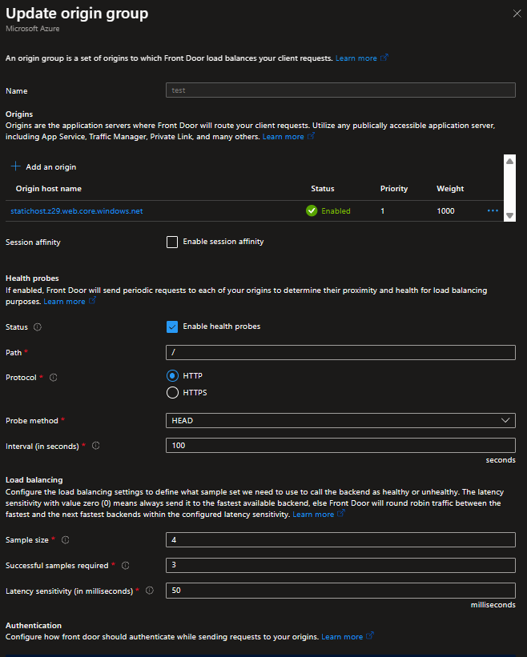

Once Origin group, Origin, and Route is configured, you can access the static page via endpoint which is `vignesh-epbshud2agc0frgy.a03.azurefd.net`

**Note:** It would take some time for Azure Front Door to load your content you might get the blue screen error or "the account being accessed does not support http" error. Just give it sometime and refresh after some minutes.

**Watch the below Azure Front Door Endpoint URL for access the static web page** 👇


## Step 4: Configure a Custom Domain to your Azure Front Door Endpoint
Now can you imagine your end users accessing your webpage using the URL `vignesh-epbshud2agc0frgy.a03.azurefd.net` of course you wouldn’t want that, you would want them to access your webpage using your preferred domain name which can be an existing one for your business or a newly registered domain name.
For this demo I would be using an existing domain I registered on namecheap.com. 

### Create Azure DNS Zone
- Search for **DNS zones** in **Azure Portal**
- Click + Create
- Configure Resource Group: Same as before (e.g., `statichost`)
- Name: `Your domain`. My domain is `vigneshsaravanan.online`
- Resource group location:** Auto-selected
- Click **Review + Create** → **Create**. Wait for deployment (1-2 minutes)

### Get Azure Nameservers
- Go to your newly created DNS zone
- On the Overview page, you'll see 4 nameservers listed
- Copy these 4 nameservers - you'll need them for Namecheap

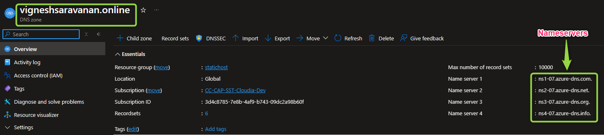

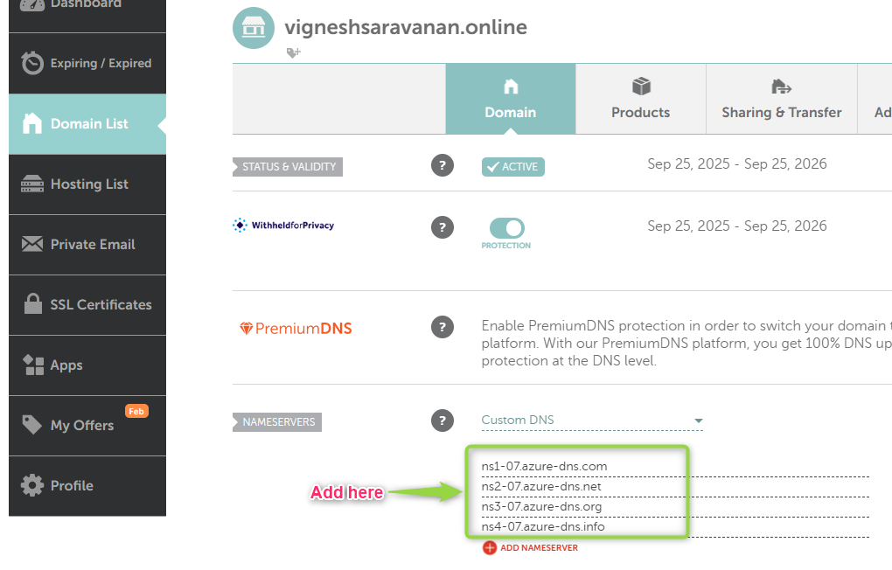

### DNS Propagation
- Propagation time: 1-48 hours (typically 1-4 hours)
- Verify propagation: `nslookup -type=NS yourdomain.com` or Go to `nslookup.io`

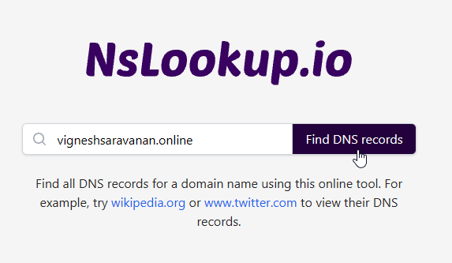

You should see Azure nameservers listed.

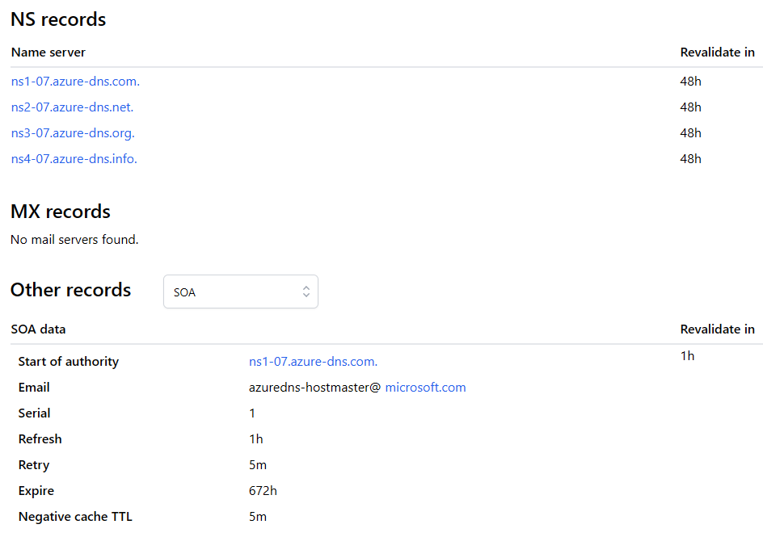

**Important:** Wait for DNS propagation before proceeding. You can continue to the next steps, but domain validation won't complete until nameservers have propagated.

### Add Custom Domain to Front Door
- Go to **Front Door** → Your **Front Door profile** (e.g., `vigneshsaravanan`)
- In left menu, click **Domains**
- Click + **Add a domain**
**Configure:**
- **Domain type:** Select Non-Azure validated domain
- **DNS management:** Select Azure managed DNS
- **Azure DNS zone:** Select your DNS zone (e.g., `yourdomain.com`)
- **Custom domain:** Enter your subdomain (e.g., `staticpage`)
- This creates `staticpage.yourdomain.com` (e.g., `https://staticpage.vigneshsaravanan.online/`)
Certificate:
- **Certificate type:** Select Azure Front Door managed
- **Minimum TLS version:** TLS v1.2
- Click **Add**

**What happens automatically ?**
Azure Front Door immediately generates a unique validation token (a TXT record value) for domain ownership.

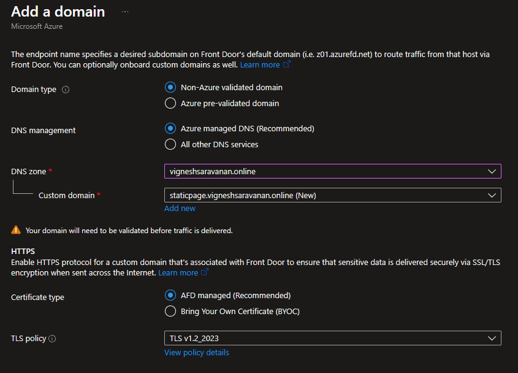

### Associate endpoint and routes
Please associate the domain with an endpoint and a route by clicking the `...` on the domain name.

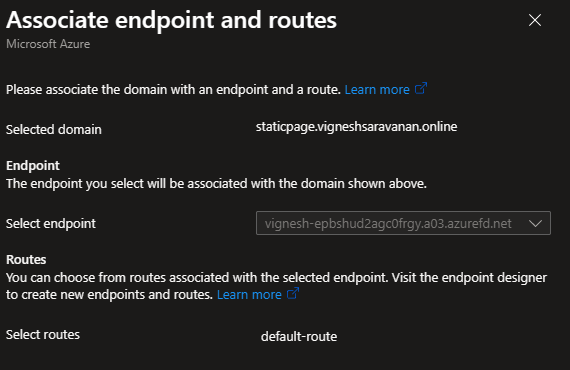

Once associated you will status will changed from not associated to associated with endpoint URL.

**NOTE:** The domain will show a `Pending` validation state in the Azure Portal.

### Create Validation TXT Record and CNAME record in Azure DNS Zone.
You don't have to manually type anything into Azure DNS. You click the `Pending` link and then click an `Add` button on the validation pane to have Azure automatically insert the `_dnsauth` TXT record into your Azure DNS zone.

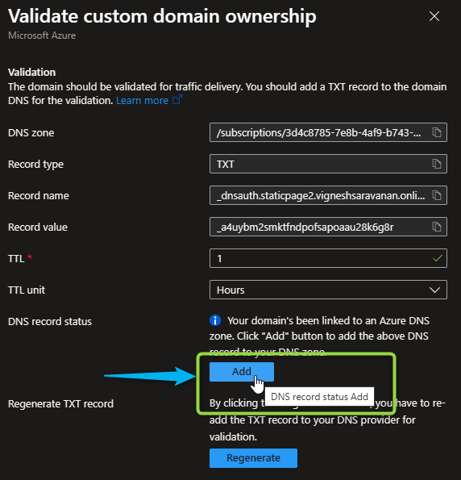

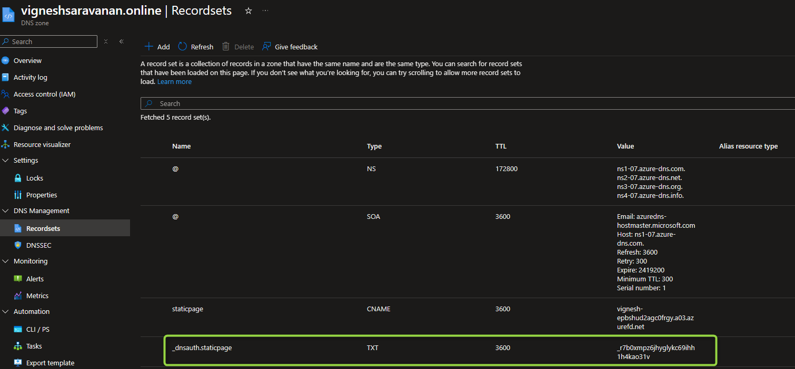

**Important:** Then, add CNAME record `staticpage` to point your `.azurefd.net` endpoint.

**Note:** Wait 5-10 minutes for DNS changes to propagate. Azure Front Door automatically checks for the validation record every few minutes. No manual action needed.

**Monitor validation status:**
Command to check only the completion of validation record and certificate deployment status.
```bash
az afd custom-domain show \
  --resource-group statichost \
  --profile-name vigneshsaravanan \
  --custom-domain-name staticpage-yourdomain-com-1218 \
  --query "{validationState:domainValidationState,deploymentStatus:deploymentStatus}"
```
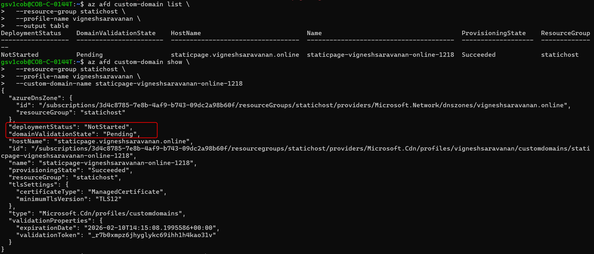

## Step 5: Verify Deployment
Check Domain Status in Portal:
- Go to **Front Door** → **Domains**
- **Check your domain status:**
    - **Provisioning state:** `Succeeded` 
    - **Validation state:** A`pproved`
    - **DNS state:** `Approved` 
    - **Certificate state:** `Succeeded`
    - **Deployment status:** `Succeeded`

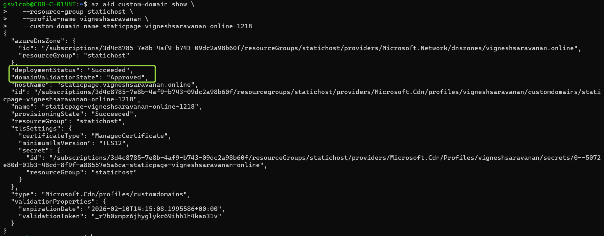

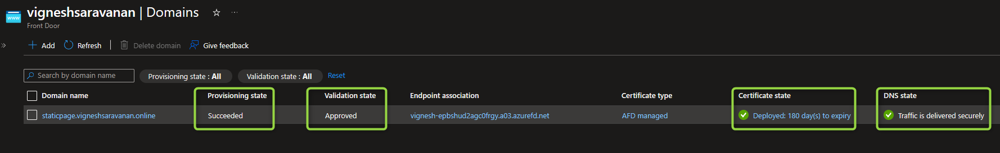

## Test Your Static Website via Custom Domain 🎉

**Open in your browser:** `https://staticpage.vigneshsaravanan.online` and access your static webpage

**Watch the below Custom Domain URL for access the static web page** 👇


**What to verify:**
- Website loads correctly
- HTTPS padlock icon shows (secure connection)
- Certificate is valid and issued to your domain
- All assets (CSS, JS, images) load properly

---
**Built by [cloudvignesh](https://github.com/cloudvignesh)**
